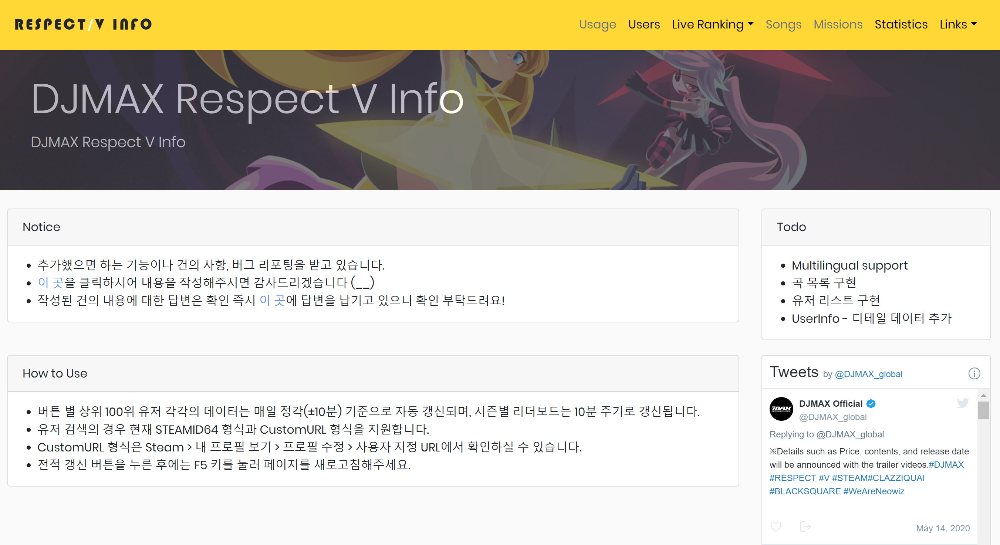
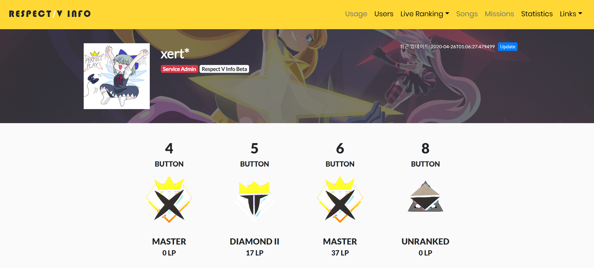
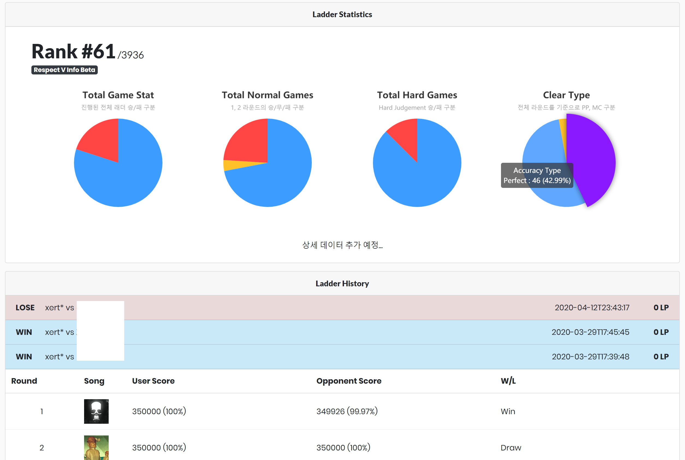
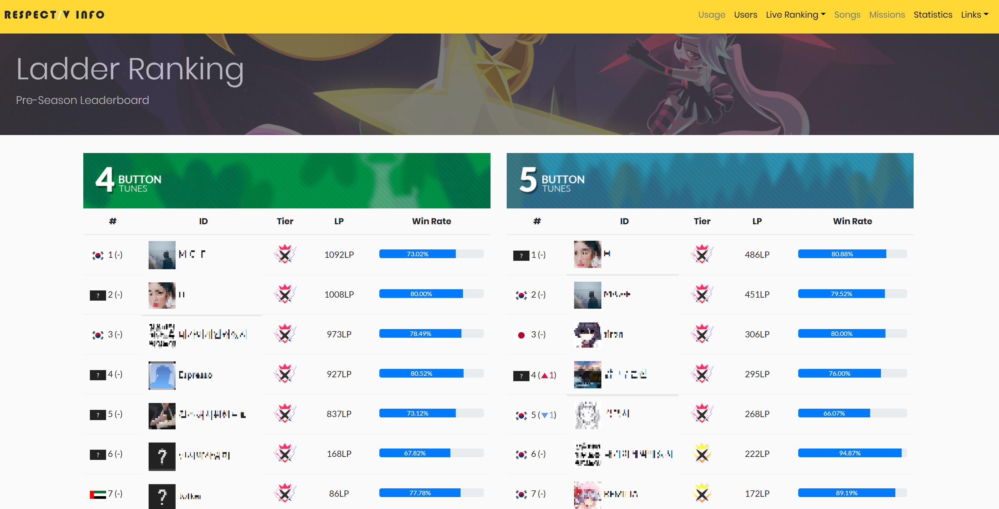

# RESPECT V INFO Service (Public)


https://djmax.slime.kr

Ladder match information service for DJMAX RESPECT V.

**This repository contains service code excluding core modules.**

## Designs

- Main


---

- User Information


---

- Ladder Statistics


---

- Ladder History


---


## Where have you been?
after the v145 patch, the ladder information could not be obtained in the conventional way, so i ended the service.

source code has not been refactored, so it can be difficult to read :(

Thank you to all users who have used the service in the meantime.

## Requirements
```
python3.8+
django3+
elasticsearch
```

## Special Thanks
- Maintainer
    - [xert*](https://twitter.com/bemusicscript)
- Front-end
    - [xert*](https://twitter.com/bemusicscript)
    - [stypr](https://harold.kim)
- Resource Provision
    - [Lapis](https://twitter.com/Lapis_BMS)
    - [BROKENPASTEL](https://www.youtube.com/channel/UC66duPrHKb_TJge0IL8x_9g)